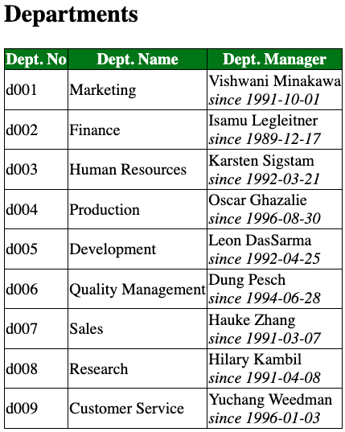

The purpose of this repository is to create a LEMP (Linux, Nginx, PHP, MySQL) stack inside Docker containers.

Regarding the database, I am using _employees_ that is freely available on the MySQL website (https://dev.mysql.com/doc/employee/en/) and licenced under the Creative Commons Attribution-ShareAlike 3.0 Unported License (https://creativecommons.org/licenses/by-sa/3.0/).

All other material in this repository is licenced under the Creative Commons Attribution-NonCommercial-ShareAlike 4.0 International.


# Create the PHP-FPM image

## 1. Build the PHP-FPM image

```shell
$ docker build -t mboulgoudan/arm64v8-php8.3fpm .
```

## 2. Create a tag (to use instead of latest)

```shell
$ docker image tag mboulgoudan/arm64v8-php8.3fpm:latest mboulgoudan/arm64v8-php8.3fpm:8.3fpm
```

## 3. Show the new created images

```shell
$ docker image ls | grep mboulgoudan
mboulgoudan/arm64v8-php8.3fpm                   8.3fpm            6149e0114fc0   51 minutes ago   563MB
mboulgoudan/arm64v8-php8.3fpm                   latest            6149e0114fc0   51 minutes ago   563MB
```

## 4. Login to DockerHub

```shell
$ docker login
docker login 
Log in with your Docker ID or email address to push and pull images from Docker Hub. If you don't have a Docker ID, head over to https://hub.docker.com/ to create one.
You can log in with your password or a Personal Access Token (PAT). Using a limited-scope PAT grants better security and is required for organizations using SSO. Learn more at https://docs.docker.com/go/access-tokens/

Username: moustapha.boulgoudan@gmail.com
Password: 
Login Succeeded
```

## 5. Push the new image to DockerHub

```shell
$ docker image push mboulgoudan/arm64v8-php8.3fpm:8.3fpm
The push refers to repository [docker.io/mboulgoudan/arm64v8-php8.3fpm]
5f70bf18a086: Pushed 
2d3d3115c0a4: Pushed 
f7cc84cb6412: Pushed 
51d0ef6bc2e8: Mounted from arm64v8/php 
a6e4ff5ba9ec: Mounted from arm64v8/php 
e34add89d288: Mounted from arm64v8/php 
4ade61e2c61f: Mounted from arm64v8/php 
d307130fc8c5: Mounted from arm64v8/php 
950b12b281af: Mounted from arm64v8/php 
276ef1748f56: Mounted from arm64v8/php 
bc862653c43d: Mounted from arm64v8/php 
40e1f0f087f9: Mounted from arm64v8/php 
d64c46ff900c: Mounted from arm64v8/php 
8.3fpm: digest: sha256:1c4d270386279cb50c08d42e0d86880cea163ec5766c861f59756636fa86be8d size: 3038
```

# Run the LEMP stack

```shell
$ docker compose up
```

## Show the new images
```shell
$ docker image ls | grep arm64v8
mboulgoudan/arm64v8-php8.3fpm                   8.3fpm            6149e0114fc0   2 weeks ago     563MB
mboulgoudan/arm64v8-php8.3fpm                   latest            6149e0114fc0   2 weeks ago     563MB
arm64v8/mysql                                   8.3               3d6757ec48c5   2 weeks ago     638MB
arm64v8/nginx                                   latest            48b4217efe5e   8 weeks ago     192MB
arm64v8/ubuntu                                  trusty            55b7b4f7c5d6   17 months ago   187MB
```

## Show running containers

```shell
$ docker ps | grep employees
4adad7174957   arm64v8/nginx:latest                  "/docker-entrypoint.…"   44 minutes ago   Up 39 minutes             0.0.0.0:81->80/tcp                                                                                                                     employees-nginx
4d94d565d6ee   mboulgoudan/arm64v8-php8.3fpm         "docker-php-entrypoi…"   44 minutes ago   Up 39 minutes             0.0.0.0:9000->9000/tcp                                                                                                                 employees-php
00ec2f31d96c   arm64v8/mysql:8.3                     "docker-entrypoint.s…"   44 minutes ago   Up 39 minutes (healthy)   33060/tcp, 0.0.0.0:3307->3306/tcp                                                                                                      employees-mysql
```

## Connect to _employees-mysql_ container and check the database

```shell
$ docker exec -it employees-mysql /bin/bash
bash-4.4# cd /docker-entrypoint-initdb.d/
bash-4.4# ls -l 
total 168276
-rw-r--r-- 1 root root     4106 Apr 14 14:04 employees.sql
-rw-r--r-- 1 root root      250 Apr 13 20:03 load_departments.dump
-rw-r--r-- 1 root root 14159880 Apr 13 20:03 load_dept_emp.dump
-rw-r--r-- 1 root root     1090 Apr 13 20:03 load_dept_manager.dump
-rw-r--r-- 1 root root 17722832 Apr 13 20:03 load_employees.dump
-rw-r--r-- 1 root root 39806034 Apr 13 20:03 load_salaries1.dump
-rw-r--r-- 1 root root 39805981 Apr 13 20:03 load_salaries2.dump
-rw-r--r-- 1 root root 39080916 Apr 13 20:03 load_salaries3.dump
-rw-r--r-- 1 root root 21708736 Apr 13 20:03 load_titles.dump

bash-4.4# mysql -uuser -ppassword

Welcome to the MySQL monitor.  Commands end with ; or \g.
Your MySQL connection id is 582
Server version: 8.3.0 MySQL Community Server - GPL

Copyright (c) 2000, 2024, Oracle and/or its affiliates.

Oracle is a registered trademark of Oracle Corporation and/or its
affiliates. Other names may be trademarks of their respective
owners.

Type 'help;' or '\h' for help. Type '\c' to clear the current input statement.

mysql> show databases;
+--------------------+
| Database           |
+--------------------+
| employees          |
| information_schema |
| performance_schema |
+--------------------+
3 rows in set (0.06 sec)

mysql> use employees;
Database changed

mysql> source employees.sql;

mysql> show tables;
+----------------------+
| Tables_in_employees  |
+----------------------+
| current_dept_emp     |
| departments          |
| dept_emp             |
| dept_emp_latest_date |
| dept_manager         |
| employees            |
| salaries             |
| titles               |
+----------------------+
8 rows in set (0.00 sec)

mysql> select * from departments;
+---------+--------------------+
| dept_no | dept_name          |
+---------+--------------------+
| d009    | Customer Service   |
| d005    | Development        |
| d002    | Finance            |
| d003    | Human Resources    |
| d001    | Marketing          |
| d004    | Production         |
| d006    | Quality Management |
| d008    | Research           |
| d007    | Sales              |
+---------+--------------------+
9 rows in set (0.01 sec)
```

# Access the _employees_ Web Application

Go to the following URL in the browser
```shell
http://localhost:81/
```
